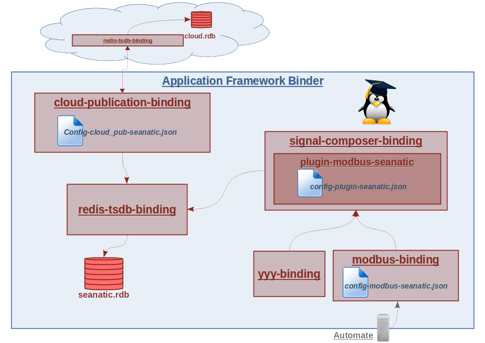

# Gateway on board

This project contains all configs sources and useful tools to run seanatic gateway project on board (tested on raspberry pi and solidrun solidense board).

## Project schema



`Modbus-binding` will get data from the automate linked in modbus through TCP socket. The `plugin-modbus-seanatic`, a  `signal-composer-binding`'s _plugin_, is here to get data from the modbus-binding, decrypt, and send them to `redis-tsdb-binding` which it will store them into a database. `Cloud-publication-binding` will be configured to take appropriate classes from the redis database and communicate with the this peer through the cloud.

## configs

In the folder **configs**, there are configurations for bindings:

* modbus-binding
* cloud-publication-binding

## binary

You will find a binary into the folder **bin** called *seanatic-gateway*. IT can setup/start and stop all necessary services to process the seanatic gateway project.

```bash
seanatic-gateway [ --start ][ --stop ][--no-security][ -h | --help ]
    - start: Start all gateway services
    - stop: Stop all services
    - no-security (optional): Use 'afb-binder' instead of 'afm-util'
```

## service systemd

It comes with a systemd service which just run the binary to startup easily the project
